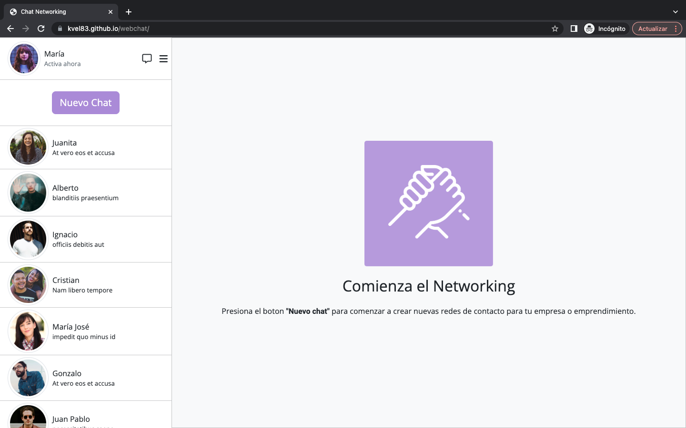
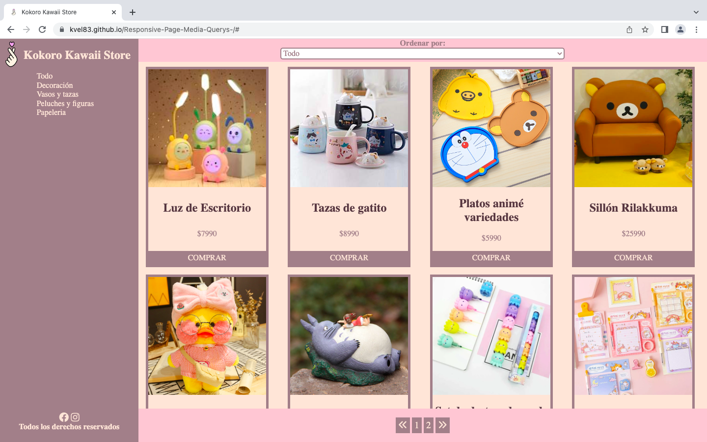
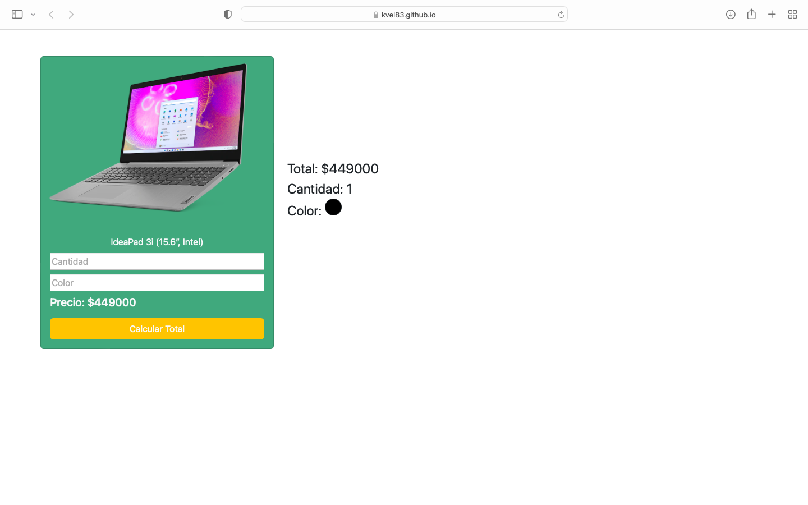

# kvel83.github.io
Examen final modulo Nª1 Carrera Desarrollo FullStack Javascript
-------
Desafio final del primer módulo de la carrera Desarrollo Full Stack JavaScript en bootcamp de Desafío Latam para lo cual se codifica el portafolio personal de proyectos teniendo links hacia los repositorios, además se deja información personal y detalle de los conocimientos adquiridos en esta primera etapa.

En este examen se evaluará el conocimiento y dominio de HTML, CSS, Bootstrap, GIT y Github.

También se podrá apreciar el avance de conocimientos obtenidos ya que se tendrá acceso a los repositorios de los desafíos anteriores.

Link para acceder a página del portafolio: https://kvel83.github.io

### DESAFÍOS PRIMER MÓDULO

- Currículum Vitae (https://github.com/kvel83/proyectosDesafioLatam/tree/main/Proyecto1(CV))

  

Pagina desarrollada con HTML, CSS y Bootstrap. Primer desafío del módulo donde debiamos demostrar el manejo de HTML realizando un correcto uso de las etiquetas básicas y semánticas así como el uso de buenas prácticas de 	             programación.

- Iguana Page(https://github.com/kvel83/proyectosDesafioLatam/tree/main/Proyecto3(Iguana%20Page))

  

Pagina desarrollada con HTML y CSS . Segundo desafío del módulo donde debíamos demostrar el conocimiento y manejo de de posicionamiento utilizando la propiedad display y haciendo uso de clases y modelo de cajas para aplicar los formatos indicados. También se evalúa la capacidad de réplicar la maqueta entregada como requerimiento y se evalúa el correcto uso de las etiquetas HTML y de buenas prácticas de programación.

- Cuppon(https://github.com/kvel83/proyectosDesafioLatam/tree/main/Proyecto4(Cuppon))

  

Página desarrollada con HTML, CSS y Bootstrap. Tercer desafío del módulo  donde debíamos realizar un uso al máximo de Bootstrap y reducir al mínimo el uso de CSS. En esta página apliqué el modelo "Mobile First" haciendola 	100% responsiva, implementé modales dinámicos y manejé con JS la validación del formulario de contacto y la información mostrada en los modales.

- WebChat(https://github.com/kvel83/webchat)

Quinto proyecto para bootcamp Desarrollo FullStack JavaScript realizado con HTML, CSS, Bootstrap y manejo de Flexbox mediante CSS y Javascript.

- Kokoro Kawaii Store(https://github.com/kvel83/Responsive-Page-Media-Querys-)

Ejercicio de desarrollo de Layout de tienda utilizando CSS Grid, Flexbox, Media Query para efectos de responsividad de la pagina y Javascript para implementar filtros de búsqueda en menú lateral (en vista mayor a 576px), filtros usando el select de la página y patinador de la página. Tercer desafio del segundo módulo de la carrera de Desarrollo Full Stack JavaScript.

- Tarjeta Dinámica de Producto(https://github.com/kvel83/tarjetaProducto)

Primer proyecto del módulo III de la carrera FullStack Developer Javascript de Desafío Latam.Se utiliza HTML + Bootstrap para maquinación de la página y Javascript para funcionalidad de cálculo del botón y validación de los inputs Cantidad y Color.
